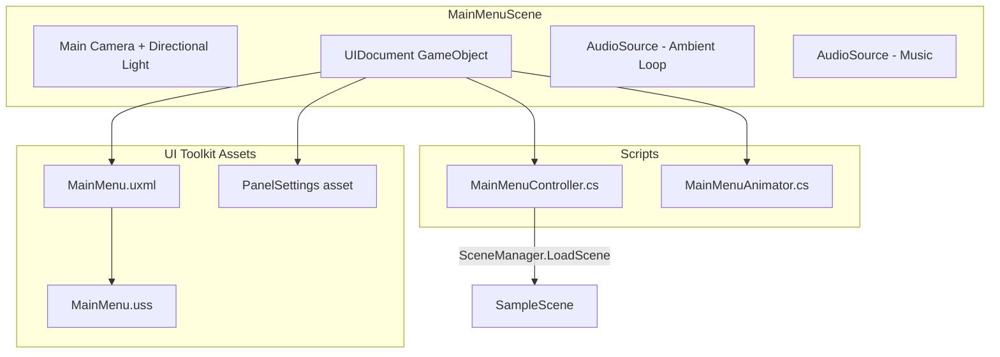

# Main Menu Scene Plan — The Hot War

> **Design Philosophy**: All UI is built with **UI Toolkit** (UXML + USS). Art slots use placeholder colors/shapes that a human artist can replace by swapping images in the USS or UXML — **zero code changes needed** for an art pass.

---

## Goal

Create a Cold War–themed main menu scene (`MainMenuScene`) using UI Toolkit that:
1. Feels atmospheric and alive (ambient sound, animated elements)
2. Uses **human-swappable art** — every visual element is a USS-styled class or a UXML `<ui:VisualElement>` with a background-image slot
3. Loads the gameplay scene (`SampleScene`) on Play
4. Follows the project's SKILL.md conventions (UniTask, DOTween, New Input System, VContainer-ready, no singletons)

---

## Architecture Overview



---

## Visual Layout (UI Toolkit)

The menu is a full-screen overlay. All art is **background-image** on USS classes — swap a PNG and the menu reskins.

```
┌──────────────────────────────────────────────────────────────────┐
│  .menu-root (full screen, dark background with vignette)         │
│                                                                  │
│  ┌─────────────────────────────────────────────────────────────┐ │
│  │  .header-container (top 40%)                                │ │
│  │                                                             │ │
│  │    .game-title-label   "THE HOT WAR"                        │ │
│  │    .subtitle-label     "A COLD WAR BUNKER PUZZLE"           │ │
│  │                                                             │ │
│  └─────────────────────────────────────────────────────────────┘ │
│                                                                  │
│  ┌─────────────────────────────────────────────────────────────┐ │
│  │  .buttons-container (center, vertical stack)                │ │
│  │                                                             │ │
│  │    [ ▶  START MISSION  ]    .menu-button                    │ │
│  │    [ ⚙  OPTIONS       ]    .menu-button                    │ │
│  │    [ ✕  QUIT          ]    .menu-button                    │ │
│  │                                                             │ │
│  └─────────────────────────────────────────────────────────────┘ │
│                                                                  │
│  ┌─────────────────────────────────────────────────────────────┐ │
│  │  .footer-container (bottom strip)                           │ │
│  │    .version-label  "v0.1 — GMTK Jam 2026"                  │ │
│  │    .credits-label  "Team Credits"                           │ │
│  └─────────────────────────────────────────────────────────────┘ │
│                                                                  │
│  .scanline-overlay (animated CSS scanline effect)                │
│  .vignette-overlay (dark edge gradient)                         │
└──────────────────────────────────────────────────────────────────┘
```

### Art-Swap Points (what humans replace)
| USS Class / Element | Current Placeholder | Artist Replaces With |
|---|---|---|
| `.menu-root` | Solid dark gradient (`#0a0a12` → `#1a1a2e`) | Background art / bunker photo |
| `.game-title-label` | Large white text "THE HOT WAR" | Custom title logo image |
| `.menu-button` | Dark bordered rectangles with hover glow | Styled button sprites |
| `.scanline-overlay` | Pure CSS repeating-gradient animation | Optional: remove or keep |
| `.vignette-overlay` | Radial gradient overlay | Optional: swap with texture |

---

## Files To Create

### 1. UXML — `Assets/Scripts/UI/MainMenu/MainMenu.uxml`
The structural layout. Three sections: header (title), center (buttons), footer (version/credits).

**Key elements** (all queryable by `name` in C#):
- `menu-root` — full-screen backdrop
- `title-label` — game title text
- `subtitle-label` — subtitle
- `start-button` — loads the game
- `options-button` — opens options (placeholder, no-op for now)
- `quit-button` — quits the application
- `version-label` — version string
- `scanline-overlay` — animated scanline layer
- `vignette-overlay` — edge darkening layer

### 2. USS — `Assets/Scripts/UI/MainMenu/MainMenu.uss`
All visual styling. Key design decisions:
- **Soviet retro palette**: deep navy `#0a0a12`, military green accents `#2d5a27`, red highlights `#c41e3a`, amber text `#d4a017`
- **Monospace / stencil font** — uses Unity's built-in for now; artist can swap to a custom TMP font
- **Scanline animation** — pure CSS `translate` animation on a repeating gradient
- **Button hover** — border glow + slight scale via USS transitions
- **All sizes in %/px** — scales to any resolution

### 3. Controller Script — `Assets/Scripts/UI/MainMenu/MainMenuController.cs`
- Thin MonoBehaviour on the UIDocument GameObject
- Queries buttons by name, wires `clicked` callbacks
- `OnStartClicked()` → `SceneManager.LoadScene("SampleScene")`
- `OnQuitClicked()` → `Application.Quit()` (with WebGL redirect fallback)
- Uses DOTween for a staggered fade-in entrance animation on the buttons

### 4. Animator Script — `Assets/Scripts/UI/MainMenu/MainMenuAnimator.cs`
- Handles ambient "alive" feel with DOTween:
  - Title text subtle pulse (scale 1.0 → 1.02, looping)
  - Button hover sound effect trigger
- Optional: pulsing red "alert" light glow on the background

### 5. Scene — `Assets/Scenes/MainMenuScene.unity`
Created via unityMCP:
- Main Camera (clear color: dark navy)
- Directional Light (very dim, moody)
- **UIDocument** GameObject with:
  - `PanelSettings` asset
  - `MainMenu.uxml` as source
  - `MainMenuController` component
  - `MainMenuAnimator` component
- **Audio** GameObject with:
  - AudioSource for `Korobeiniki` music (existing asset at `Assets/Music/Korobeiniki _ Коробейники...mp3`)
  - AudioSource for ambient bunker hum (using existing `HVAC Loop 001.wav` from `Assets/Music/Modern/`)

### 6. PanelSettings — `Assets/Settings/MainMenuPanelSettings.asset`
- Scale mode: `ScaleWithScreenSize`
- Reference resolution: `1920×1080`
- Sort order: `0`

---

## Audio — Using Existing Assets

| Slot | Existing Asset Path | Role |
|---|---|---|
| Background Music | `Assets/Music/Korobeiniki _ Коробейники - Best Version - With Lyrics.mp3` | Soviet-themed menu music |
| Ambient Loop | `Assets/Music/Modern/HVAC Loop 001.wav` | Bunker hum ambience |
| Button Click SFX | `Assets/Music/Triggers/Spring Button A.wav` | Menu button click feedback |
| Button Hover SFX | `Assets/Music/Triggers/Thick Flick A.wav` | Subtle hover audio cue |

---

## Implementation Order

| Step | What | Tool |
|---|---|---|
| 1 | Create `MainMenu.uss` stylesheet | `write_to_file` |
| 2 | Create `MainMenu.uxml` layout | `write_to_file` |
| 3 | Link stylesheet to UXML | `unityMCP manage_ui(link_stylesheet)` |
| 4 | Create `PanelSettings` asset | `unityMCP manage_ui(create_panel_settings)` |
| 5 | Create `MainMenuController.cs` | `write_to_file` |
| 6 | Create `MainMenuAnimator.cs` | `write_to_file` |
| 7 | Refresh Unity (compile check) | `unityMCP refresh_unity` → `read_console` |
| 8 | Create `MainMenuScene` via MCP | `unityMCP manage_scene(create)` |
| 9 | Add UIDocument GO + wire components | `unityMCP manage_gameobject` + `manage_components` |
| 10 | Add Audio GameObjects + wire clips | `unityMCP manage_gameobject` + `manage_components` |
| 11 | Save scene | `unityMCP manage_scene(save)` |
| 12 | Add to Build Settings | `unityMCP manage_build(scenes)` |

---

## MCP Server Notes

- Use **`unityMCP`** (port 8080) for all live Unity Editor interactions — creating scenes, wiring components, setting serialized references, etc.
- The `unity` MCP may be connected to the wrong project (ColorUp). Always use `unityMCP`.
- **Never hand-edit scene or prefab YAML** — use MCP calls instead.
- After creating/modifying scripts, always call `refresh_unity` then `read_console` to verify compilation before wiring components.

---

## Art Handoff Notes for Humans

**For artists**: You can reskin the entire menu without touching code:
1. **Title logo** — Replace the text label with a `<ui:VisualElement>` with `background-image` in the UXML, or set `background-image` on `.game-title-label` in the USS
2. **Background** — Set `background-image` on `.menu-root` in the USS to any 1920×1080 bunker art
3. **Buttons** — Modify `.menu-button` border, colors, and background in the USS
4. **Font** — Drop a `.ttf` into Assets, reference it with `-unity-font-definition` in USS
5. **Scanlines** — Delete or modify `.scanline-overlay` in USS to remove/change the effect

All element names and class names are documented above. Open `MainMenu.uxml` in Unity's **UI Builder** for a visual WYSIWYG editor — drag, drop, and restyle without code.

---

## Project Context for Future Agents

- **Project**: The Hot War — first-person Cold War bunker puzzle game for GMTK Jam 2026
- **Unity Version**: 6000.3.15f1, URP 17.3.0, WebGL target
- **Coding Standards**: See `SKILL.md` at repo root (UniTask, DOTween, VContainer, New Input System, Allman braces, `var` preference)
- **Full Architecture**: See `CLAUDE.md`, `overview.md`, `architecture.mermaid` at repo root
- **Existing UI scripts live in**: `Assets/Scripts/UI/` (EvidenceHudView.cs, KeypadPopupUI.cs, PuzzleCardInventoryView.cs)
- **UI Toolkit module** (`com.unity.modules.uielements`) is already in `Packages/manifest.json`
- **No MainMenu scene exists yet** — this plan creates the first one
- **Existing scenes**: SampleScene (graybox), GeneratorRoom, IdentificationRoom, RadarRoom
